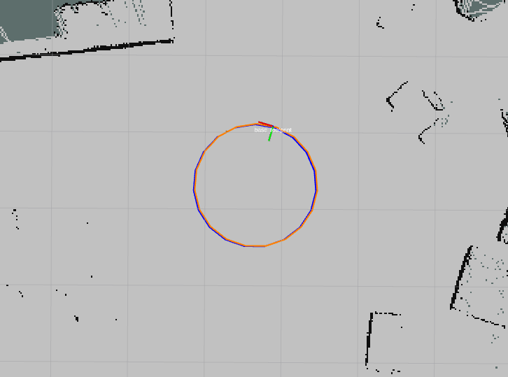

# circle_patroller
ROS node to allow a turtlebot to track a circle trajectory

# Install

git clone to your_catkin_ws/src/ directory
catkin build circle_patroller

# Example usage (turtlebot)

roslaunch circle_patroller slam_and_circle_patroller.launch

in rviz, press the 'g' key, then click on the map to place the circle center.

The blue circle is the reference circle to be tracked, the orange circle is the currently planned trajectory to get back to the reference circle.
